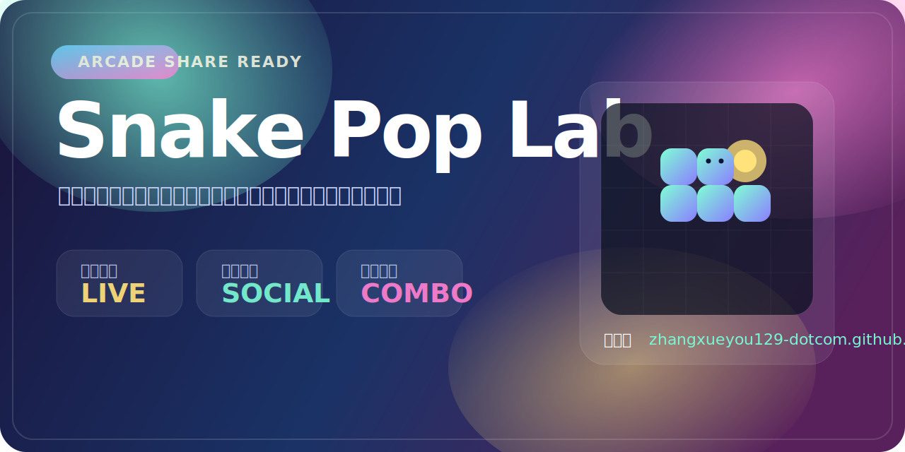

# Snake Pop Lab

糖果霓虹风的贪食蛇小游戏，适合直接试玩、录屏传播和活动预热。

在线试玩：
[https://zhangxueyou129-dotcom.github.io/snake-pop-lab/](https://zhangxueyou129-dotcom.github.io/snake-pop-lab/)

GitHub 仓库：
[https://github.com/zhangxueyou129-dotcom/snake-pop-lab](https://github.com/zhangxueyou129-dotcom/snake-pop-lab)

## 项目亮点

- 糖果色霓虹视觉，适合截图和短视频传播
- 连击驱动的音效变化，越连击越上头
- 支持系统分享、海报导出、社媒快捷跳转
- 单文件网页版本，打开即玩，部署简单

## 玩法说明

- 方向键或 `W A S D` 控制移动
- 空格可暂停或继续
- 连续吃到果子会触发更强的热度状态和更丰富的音效

## 分享能力

- `X`、`Facebook`、`Telegram` 支持带文案的一键分享链接
- `抖音`、`Instagram` 提供复制文案并打开平台的快捷流
- 内置战绩文案和分享海报，方便直接发布

## 本地使用

直接打开 [index.html](./index.html) 即可开始游戏。

## 适合的使用场景

- 小游戏作品展示
- GitHub Pages 在线试玩
- 活动页引流素材
- 社交平台传播 Demo
