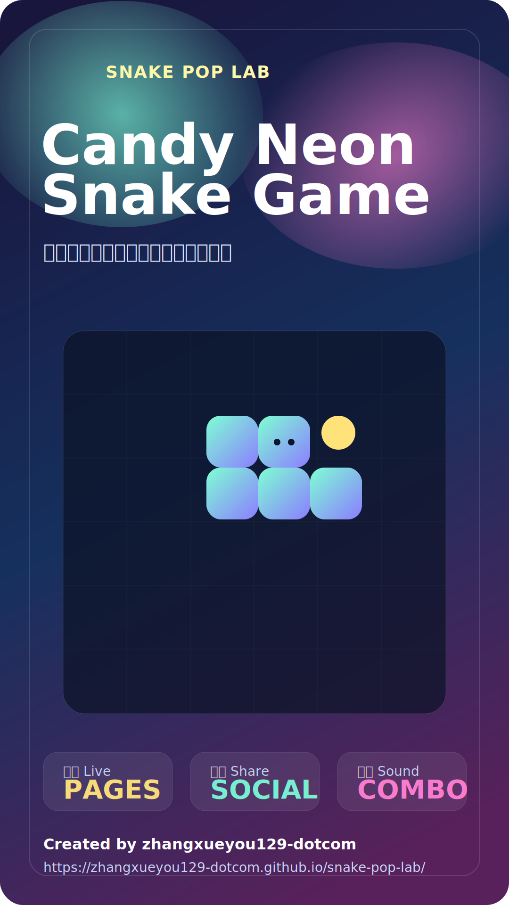

# Snake Pop Lab

Candy-neon Snake game with combo-reactive sound effects, score poster export, and social sharing shortcuts.

Online demo:
[https://zhangxueyou129-dotcom.github.io/snake-pop-lab/](https://zhangxueyou129-dotcom.github.io/snake-pop-lab/)

GitHub repository:
[https://github.com/zhangxueyou129-dotcom/snake-pop-lab](https://github.com/zhangxueyou129-dotcom/snake-pop-lab)

Vertical social cover:

## 中文介绍

`Snake Pop Lab` 是一个糖果霓虹风的贪食蛇小游戏，适合直接试玩、录屏传播和活动预热。

### 亮点

- 糖果色视觉和发光元素，适合截图与短视频传播
- 连击越高，吃到果子的音效越丰富
- 支持系统分享、海报导出和社媒快捷转发
- 单文件网页版本，打开即玩，部署简单

### 玩法

- 使用方向键或 `W A S D` 控制移动
- 按空格可以暂停或继续
- 连续吃到果子会触发更强的热度状态和更明显的音效变化

### 分享能力

- `X`、`Facebook`、`Telegram` 支持带文案的分享链接
- `抖音`、`Instagram` 提供复制文案并打开平台的快捷流
- 页面内置战绩文案和分享海报

## English

`Snake Pop Lab` is a candy-neon Snake game built for quick play, social sharing, and showcase demos.

### Highlights

- Candy-color visuals with glowing arcade styling
- Combo-based eat sounds that evolve as the streak increases
- Built-in poster export, native share, and social shortcuts
- Single-file web version that is easy to deploy anywhere

### Controls

- Use arrow keys or `W A S D` to move
- Press space to pause or resume
- Keep eating fruits in a row to enter stronger heat states and richer sound feedback

### Social Features

- `X`, `Facebook`, and `Telegram` support prefilled share links
- `Douyin` and `Instagram` use a copy-and-open flow for practical web sharing
- The page includes score copy and a built-in share poster

## Brand

- Product name: `Snake Pop Lab`
- Author: `zhangxueyou129-dotcom`
- Brand assets:
[logo-mark.svg](./logo-mark.svg)
[social-cover.svg](./social-cover.svg)
[social-cover-vertical.svg](./social-cover-vertical.svg)

## Local Use

Open [index.html](./index.html) directly in a browser to start playing.
